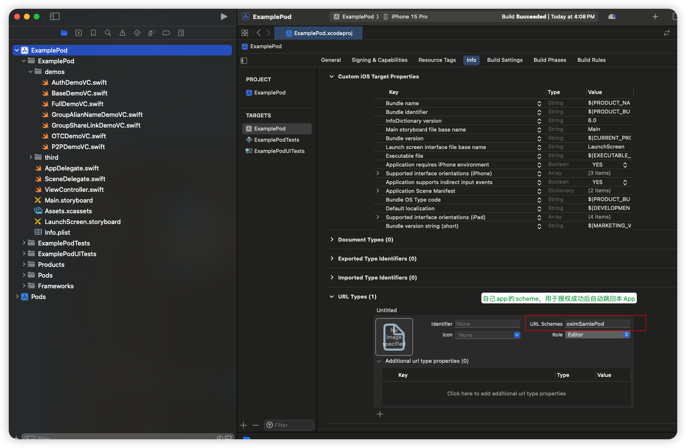
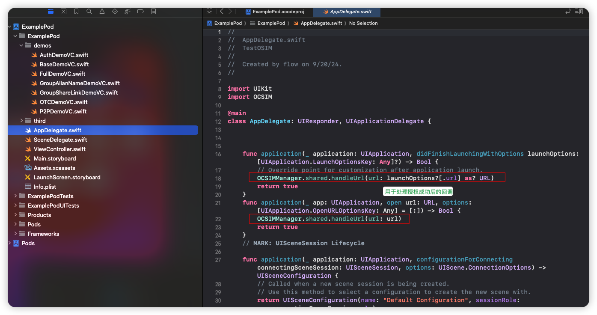
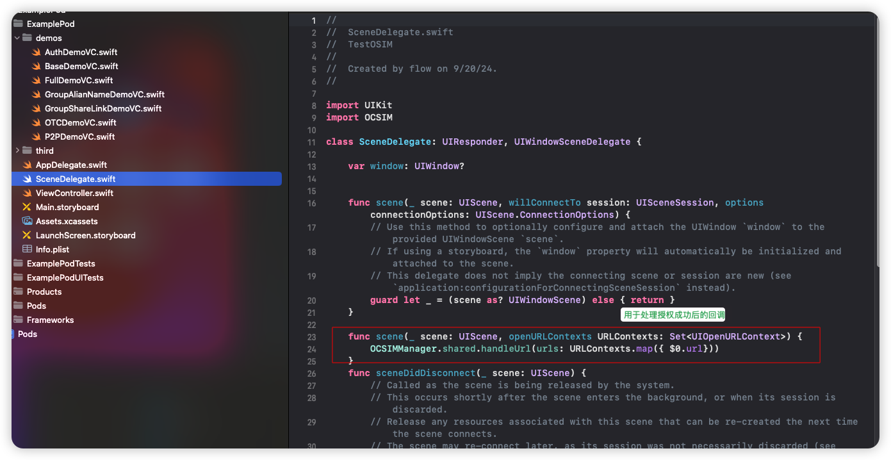

OCSIM
=============

使用OCSIM开放功能
- 使用xx号添加好友
- 使用群二维码链接加入群
- 使用群别名入群
- 授权登录
- 其他功能

### 重点介绍授权功能
##### 1、找相关人员申请`appKey`

#### 2、引入SDK
#### 2.1 方式一：直接将`OCSIMManager.swift`拖到项目里,参考`Example`
#### 2.2 方式二：使用`cocoapod`的方式引入，参考`ExamplePod`
#### 2.3 方式三：使用`spm`的方式引入

#### 3、在项目的Info.plist里设置一个scheme，如果项目里已经有scheme，可以忽略此步骤，该scheme主要用于下面第5步，用于授权成功后自动返回当前app使用


#### 4、在AppDelegate里设置接收URL的回调处理，参考如下：
`SceneDelegate.swift`
```
@main
class AppDelegate: UIResponder, UIApplicationDelegate {
    // ... 其他内容
    func application(_ application: UIApplication, didFinishLaunchingWithOptions launchOptions: [UIApplication.LaunchOptionsKey: Any]?) -> Bool {
        // Override point for customization after application launch.
        OCSIMManager.shared.handleUrl(url: launchOptions?[.url] as? URL)
        return true
    }
    func application(_ app: UIApplication, open url: URL, options: [UIApplication.OpenURLOptionsKey: Any] = [:]) -> Bool {
        OCSIMManager.shared.handleUrl(url: url)
        return true
    }
    // ... 其他内容
}
```


如果项目里有`SceneDelegate.swift`, 还需要再这里设置
```
class SceneDelegate: UIResponder, UIWindowSceneDelegate {

    // ... 其他内容
    func scene(_ scene: UIScene, openURLContexts URLContexts: Set<UIOpenURLContext>) {
        OCSIMManager.shared.handleUrl(urls: URLContexts.map({ $0.url}))
    }
    // ... 其他内容
}
```


#### 5、在需要调用的地方调用,参考`AuthDemoVC.swift`
```
@objc func btnClick() {
    // 默认跳转到68、生产环境
    // appKey: 为第1步找相关人员申请到的值
    // callbackUrl: 为3布配置的scheme或已有的scheme
    OCSIMManager.shared.jump(goTo: .authWithCustomUrl(appKey: "xxxx", callbackUrl: "xxxx://"), handler: {[weak self] dict in
        self?.codeLabel.text = "授权code：\(dict["code"]  ?? "")"
        print(dict)
    })
}
```
----


